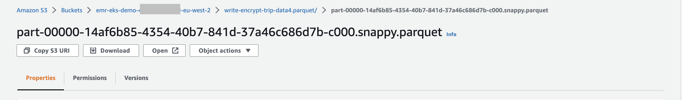
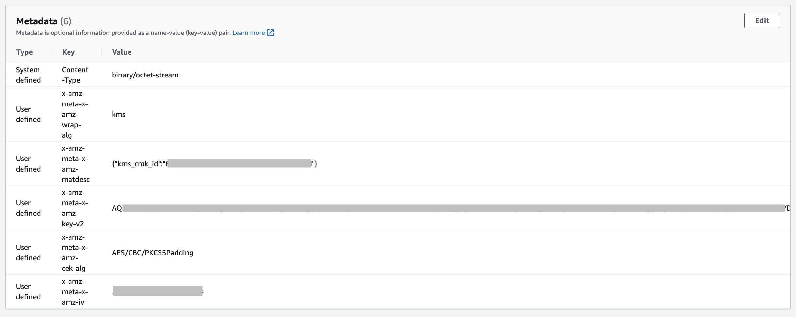
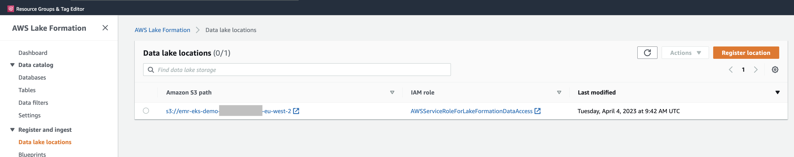
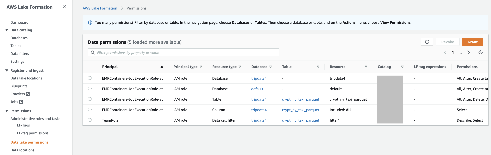
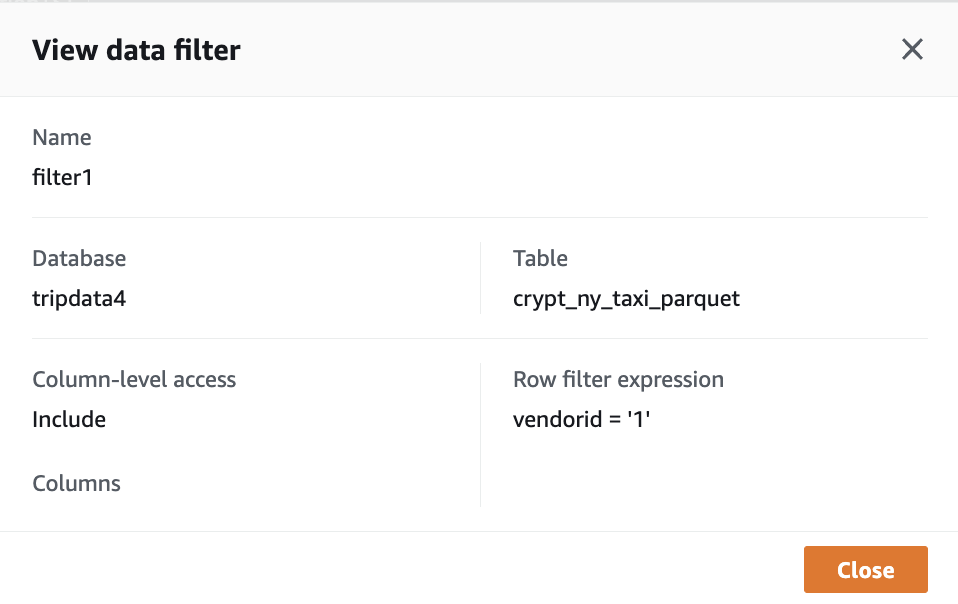
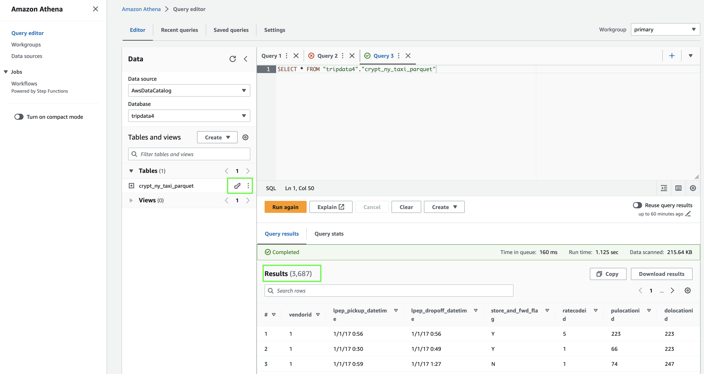
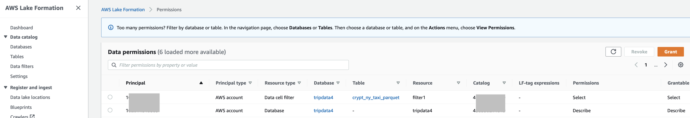
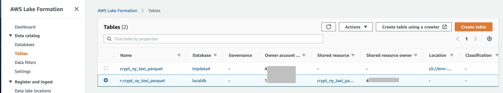
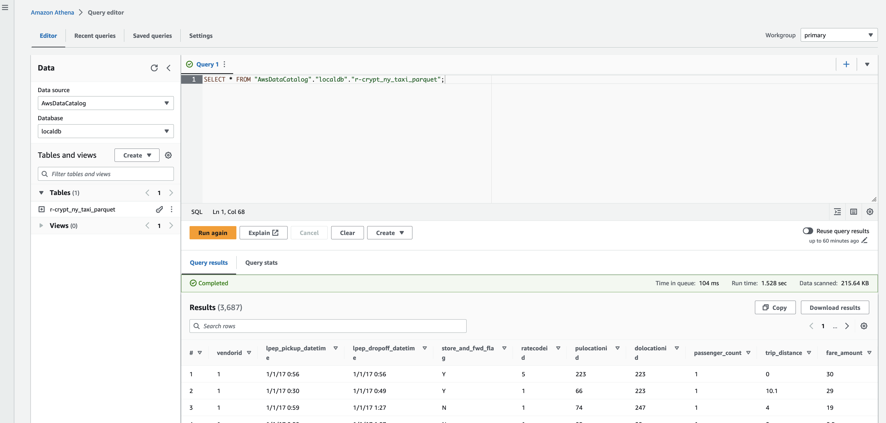

# Accessing Client Side Encrypted Data with Athena and Lake Formation

## Overview of Steps

* Create KMS Key
* Setup a fargate (serverless) based EKS cluster
* Enable EMR on EKS
* Prepare a spark job to client side encrypt (CSE) the raw data (.csv file) & populate Glue catalog
* Verify data is client side encrypted on S3

* Put bucket & CSE data under Lake Formation control, setup a Lake Formation data filter.
* Setup Lake Formation data access permissions
* Adjust KMS Key policy
* Query Data with Athena (V3)

* Setup Cross Account access for consumer account via Lake Formation
* Setup Lake Formation resource links in consumer account
* Verify Athena access in the consumer account

---------


## Create a KMS key:

export KeyID=$(aws kms create-key --query KeyMetadata.KeyId --output text)


## Setup serverless (Fargate) EKS environment - for EMR on EKS

```bash
eksctl create cluster -f cluster.yaml
```

----

## Setup EMR on EKS

```bash
./add-emr-toeks.sh
```

-----

## Create a bucket

```bash
export ACCOUNT_ID=$(aws sts get-caller-identity --query Account --output text)
export AWS_REGION=$(aws configure get region)
export s3DemoBucket=s3://emr-eks-demo-${ACCOUNT_ID}-${AWS_REGION}
aws s3 mb $s3DemoBucket
```

## copy the raw data tripdata.csv into the bucket - ready for spark job

```bash
aws s3 cp s3://aws-data-analytics-workshops/shared_datasets/tripdata/tripdata.csv tripdata.csv
aws s3 cp tripdata.csv s3://emr-eks-demo-${ACCOUNT_ID}-${AWS_REGION}/data/tripdata.csv 
```


-----

## Prep spark code to read raw data - and write to parquet (with client side encryption from EMR)  + populate glue catalog

```bash
cat > trip-count-encrypt-write4.py <<EOF
import sys
from pyspark.sql import SparkSession

if __name__ == "__main__":

    spark = SparkSession.builder.appName("trip-count-crypt").enableHiveSupport().getOrCreate()

    df = spark.read.csv('s3://emr-eks-demo-${ACCOUNT_ID}-${AWS_REGION}/data/tripdata.csv', header=True)
    print("Total trips: " + str(df.count()))

    #Registers this DataFrame as a temporary table using the given name.
    #The lifetime of this temporary table is tied to the SparkSession that was used to create this DataFrame.

    df.registerTempTable("ny_taxi_table")


    df.write.parquet('s3://emr-eks-demo-${ACCOUNT_ID}-${AWS_REGION}/write-encrypt-trip-data4.parquet')
    print("Encrypt - KMS- CSE writew to s3 compeleted")

    dbName = "tripdata4"
    print("Create glue db ..")
    spark.sql("CREATE database if not exists " + dbName)
    print("use glue db .. +dbname")
    spark.sql("USE " + dbName)

    print("Create glue table..")
    
    spark.sql("CREATE table if not exists crypt_ny_taxi_parquet USING PARQUET LOCATION '" + "s3://emr-eks-demo-${ACCOUNT_ID}-${AWS_REGION}/write-encrypt-trip-data4.parquet" + "' TBLPROPERTIES ('has_encrypted_data'='true') AS SELECT * from ny_taxi_table ")
    print("Finished glue ....")


    spark.stop()
EOF
```

-----

## submit job to CSE data and write to glue catalog

```bash
./job-write4-cse.sh
```


In S3 console check the s3 object the output object `write-encrypt-trip-data4.parquet` headers are showing client side encryption 







-------

Next - put this under LakeFormation control and then try to query via Athena
Ensuring that:

* The Athena Engine is set to V3
* Configure Athena to CSE it's output

* In Lake Fromation - The data lake location specifies  emr-eks-demo-${ACCOUNT_ID}-${AWS_REGION}, using the default `AWSServiceRoleForLakeFormationDataAccess` service role:



* All IAM access is turned off in Lake Formation (All `IAMAllowedPrincipals` permissions removed)
* That the role used for the data lake location has access to the Key via the KMS key policy (see below)
* Set the Lake Formation data access permissions:



-----

In AWS EventEngine accounts the user role is `TeamRole`

When using Athena & Lakeformation, LakeFormation issues requests to KMS via an assumed role:
arn:aws:sts::xxxxxxxxxxxx:assumed-role/TeamRole/AWSLF-00-AT-xxxxxxxxxxxx-yyyyyyyyyy

Where yyyyyyyyyy changes everytime there is a call to KMS, we have to account for this in the KMS key policy (see below)


The KMS key policy you use must include a "*" for the principal to help match against the AWSLF-00-AT-$(ACCOUNT_ID}-xxxxxxxxxxxx-yyyyyyyyyy. And also a condition to lock it down to the Lake Formation pattern  `AWSLF*` above and the role associated with the Data Lake Location, The EMR execution role the user "TeamRole" mentioned above & the service role AWSServiceRoleForLakeFormationDataAccess


for example:


```
{
    "Sid": "Allow use of the key",
    "Effect": "Allow",
    "Principal": {
        "AWS": [
            "*"
        ]
    },
    "Action": [
                "kms:Encrypt",
                "kms:Decrypt",
                "kms:ReEncrypt*",
                "kms:GenerateDataKey*",
                "kms:DescribeKey"
    ],
    "Resource": "*",
    "Condition": {
        "ArnLike": {
            "aws:PrincipalArn": [
                "arn:aws:sts::xxxxxxxxxxxx:assumed-role/TeamRole/AWSLF-00-AT-xxxxxxxxxxxx-*",
                "arn:aws:iam::xxxxxxxxxxxx:role/aws-service-role/lakeformation.amazonaws.com/AWSServiceRoleForLakeFormationDataAccess",
                "arn:aws:iam::xxxxxxxxxxxx:role/EMRContainers-JobExecutionRole-at",
                "arn:aws:iam::xxxxxxxxxxxx:role/TeamRole"
            ]
        }
    }
}
```


You can also optionally apply data filters in LakeFormation

vendorid = '1'




Here's an end result -  a client side encryted parquet file being queried (note the key icon) with Lake Formation data filter also being applied :



The table has 20,000 rows - but only 3687 are being return due to the Lake Formation data filter ( vendorid='1' )

-------

## Cross Account Data Sharing

Grant Permissions to the remote (consumer) Account in Lake Formation



### Switch to the consumer account

Accept the incoming RAM shares form the RAM console

In Lake Formation setup the resource link to the remote table:



Query the data form Athena




